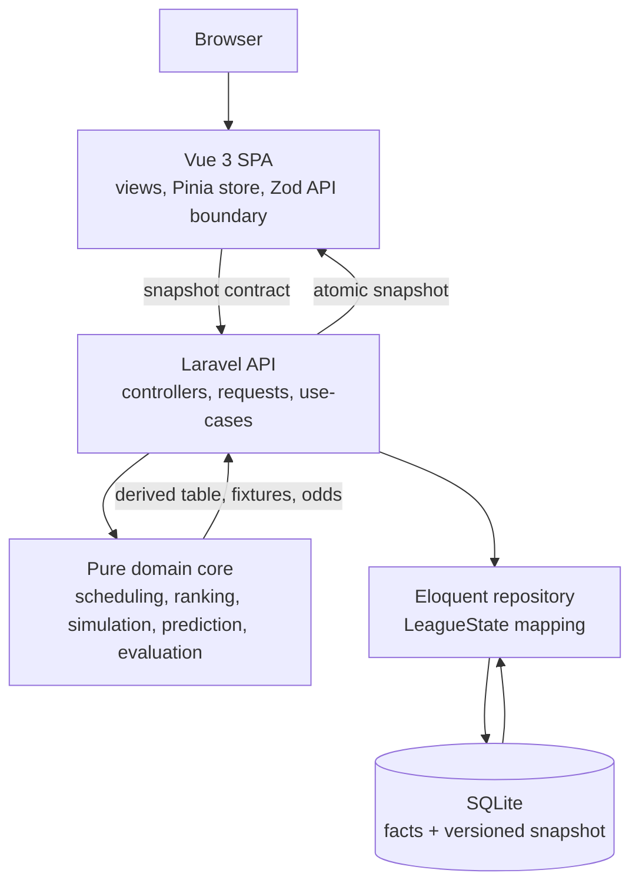

# Champions League Simulation

**Live demo: [ucl-sim.fly.dev](https://ucl-sim.fly.dev/)**

[](https://ucl-sim.fly.dev/)
[](https://github.com/osmanorhan/ucl-sim/actions/workflows/ci.yml)
[](https://sonarcloud.io/summary/new_code?id=osmanorhan_ucl-sim)
[](apps/api/composer.json)
[](apps/api/composer.json)
[](.github/workflows/ci.yml)
[](apps/web/package.json)
[](.github/workflows/ci.yml)

A four-team Champions League group simulated under Premier League rules. Scoring and championship-prediction strategies
are pluggable behind seams, and an **evaluation harness** grades them against each other
(better / safer / faster) with proper scoring rules. The thesis: no single algorithm always wins,
so the interesting artifact is the harness that compares them.

Design rationale lives in [`docs/plan.md`](docs/plan.md); every non-trivial decision is an ADR in
[`docs/decisions/`](docs/decisions/). Engineering principles are in [`CLAUDE.md`](CLAUDE.md).

**Stack:** PHP ^8.3 (CI: 8.4) / Laravel 13 (API-only) · Vue 3 + TypeScript (SPA) · SQLite · Pest 4 ·
PHPStan max · Pint.

---

## Architecture

A pure domain core with side effects pushed to the edges:

### Application architecture



The client renders the server snapshot; it does not recompute standings, fixtures, or predictions.
Laravel owns mutations. The domain owns rules and algorithms. SQLite stores facts plus the latest
snapshot. Detailed diagrams for mutation flow, strategy seams, prediction, evaluation, and
persistence are in [`docs/architecture-diagrams.md`](docs/architecture-diagrams.md).

```
app/Domain/          pure PHP, zero Illuminate imports (enforced by an arch test)
  Team/ League/ Ranking/ Scheduling/ Simulation/ Prediction/ Evaluation/ Random/ Persistence/
app/Application/      use-cases: LeagueService, SnapshotAssembler, StrategyEvaluator
app/Infrastructure/  Eloquent repository, StrategyRegistry
app/Http/            controllers, FormRequests
app/Models/          Eloquent models (League, Team, MatchRecord)
```

Load-bearing seams:

- **`ChampionPredictor`** — `MonteCarloPredictor`, `DeterministicClincher`,
  `PointsHeuristicPredictor` (baseline), and `SettledOrSimulated` (the live decorator: exact when
  the title is decided, simulated otherwise).
- **`EvaluationHarness`** — scores predictors against *realised* outcomes (Brier + log-loss) under
  common random numbers; this is the differentiator (ADR-05).
- **`LeagueRepository`** — persistence behind an interface; SQLite today, Postgres is a drop-in
  (ADR-02).

Two invariants worth calling out:

- **Facts are the source of truth; views are re-folded.** Only match results are stored. The table,
  fixtures, and predictions are pure projections recomputed on each write into one versioned
  snapshot, so an edit can never leave them disagreeing (ADR-01/03/06).
- **`play-week × N ≡ play-all`.** Each week is simulated from a source seeded purely on
  `(seed, week)`, so incremental and one-shot play are byte-identical and reproducible from the
  league seed (ADR-06).

---

## Getting started

```bash
make install                      # composer (api) + pnpm (web) deps

cd apps/api
cp .env.example .env              # first run only
php artisan key:generate
php artisan migrate
php artisan serve                 # http://localhost:8000  (API under /api)
```

---

## API surface

State-changing endpoints return one atomic, versioned snapshot
`{ version, league, table, fixtures, predictions }` from a single server state (ADR-03).

| Method | Path | Purpose |
|---|---|---|
| `POST` | `/api/leagues` | create a league (`name`, `seed`, even list of `teams`) → snapshot |
| `GET`  | `/api/leagues/{id}` | full snapshot |
| `GET`  | `/api/leagues/{id}/table` | projected standings |
| `GET`  | `/api/leagues/{id}/fixtures` | fixtures grouped by week (+ results) |
| `GET`  | `/api/leagues/{id}/predictions` | championship odds — `409` until week ≥ 4 |
| `GET`  | `/api/leagues/{id}/evaluation` | strategy scorecards from the harness |
| `POST` | `/api/leagues/{id}/play-week` | simulate the next week → snapshot |
| `POST` | `/api/leagues/{id}/play-all` | simulate to season end → snapshot |
| `PUT`  | `/api/matches/{id}` | edit a result (`homeGoals`, `awayGoals`) → snapshot |

A ready-to-run **Bruno** collection for all of these lives in [`bruno/`](bruno/) — open the folder
in [Bruno](https://www.usebruno.com), pick the **Local** environment, and run the requests top to
bottom (the create request captures `leagueId`/`matchId` for the rest).

### Scope

A few things are left out on purpose, each with a ready seam rather than a stub:

- **No authn/authz.** Mutating endpoints and the heavy evaluation harness are IP rate-limited at
  the Laravel edge; production would add league ownership before exposing shared data.
- **No live multi-tab push.** Concurrent writes are already *correct* — the optimistic `version`
  guard rejects a stale write (HTTP 409) and the client discards out-of-order snapshots (ADR-03/07),
  so two tabs can never diverge. A second tab's *view* simply won't refresh until its next action; a
  push channel (WebSocket/SSE/`BroadcastChannel`) drops in behind the same `applySnapshot` seam with
  no view change (ADR-07) when that freshness is worth the moving parts.
- **No event log.** We store current facts and re-fold them (ADR-06); we don't journal an
  append-only stream of `MatchPlayed`/`ResultEdited`. That stream would add audit, undo, and
  time-travel — and provenance is half there already (every result carries `ResultOrigin`).
- **Synchronous evaluation.** The harness runs in-request, IP rate-limited to protect the box;
  production would hand it to a queue/worker and poll the job.
- **Single-writer, single node.** One machine + SQLite is deliberate for the write model
  (ADR-02/08); horizontal scale would swap in the Postgres drop-in behind `LeagueRepository` (ADR-02).

---

## Testing

```bash
make test          # api (domain + feature) and web (Vitest)
make coverage      # Clover (API) + LCOV (web), consumed by Sonar
make sonar         # coverage + local sonar-scanner
make e2e           # browser end-to-end (Playwright)
make stan          # PHPStan, level max
make arch          # domain-purity fitness test
make lint          # Pint (format check)
cd apps/api && composer test:mutation  # domain mutation score gate
```

- **Domain / unit** — Pest, deterministic via seeded RNG; exact-sequence and distribution assertions.
- **Feature / API** — `apps/api/tests/Feature/LeagueApiTest.php`: create, play-week, the
  `play-week ≡ play-all` invariant, edit re-fold, prediction gating, evaluation ranking, 404/409,
  and validation.
- **Architecture** — `app/Domain` may not import `Illuminate\*`; enforced in CI, not by discipline.
- **Mutation** — Pest mutates covered `App\Domain` code in CI with an explicit score gate.
- **Web** — Vitest pins the pure SPA seams; Playwright drives the built app against a mocked API
  (happy path + edge cases). See [`apps/web/README.md`](apps/web/README.md).
- **Coverage / Sonar** — API coverage requires Xdebug or PCOV enabled locally. Sonar config lives
  in [`sonar-project.properties`](sonar-project.properties).

---

## Deployment

The API and the built SPA ship as **one same-origin container** (FrankenPHP serves both; the
client calls `/api/*` relative, so there is no CORS). Run the exact production image locally:

```bash
make up                           # docker compose → http://localhost:8080
```

CI ([`.github/workflows/ci.yml`](.github/workflows/ci.yml)) runs the API and web gates (including
the Playwright E2E) **and builds the production image, boots it, and smoke-tests every serving
class** (`infra/smoke.sh` — health, SPA, deep-link fallback, static assets, `/api`). Only when all
three jobs are green does `main` deploy to Fly.io. One-time setup:

```bash
fly launch --no-deploy            # creates the app from fly.toml
fly volumes create sqlite_data --size 1     # persistent SQLite disk at /data
fly secrets set APP_KEY="$(php apps/api/artisan key:generate --show)"
# add FLY_API_TOKEN to GitHub repo secrets so the deploy job can push
```

Then every push to `main` deploys; or `make deploy` by hand. The DB file lives on the volume, so
the season survives redeploys — one machine is correct for the single-writer model (ADR-02/08).

---

## Project layout

```
apps/api/   Laravel 13 API (Composer)
apps/web/   Vue 3 + Vite SPA (pnpm)
bruno/      Bruno API collection
docs/       plan.md + decisions/ (ADRs)
```
