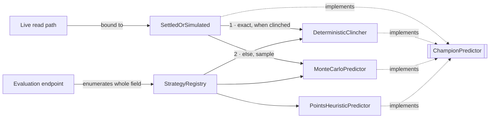
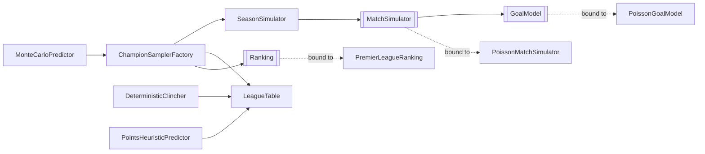
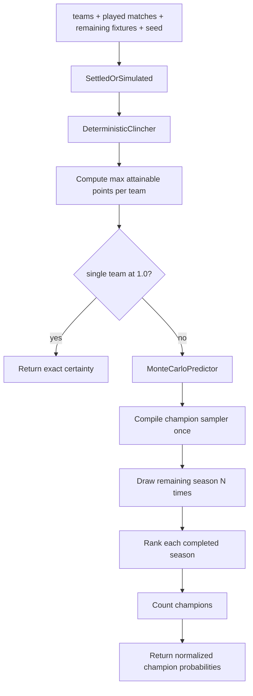
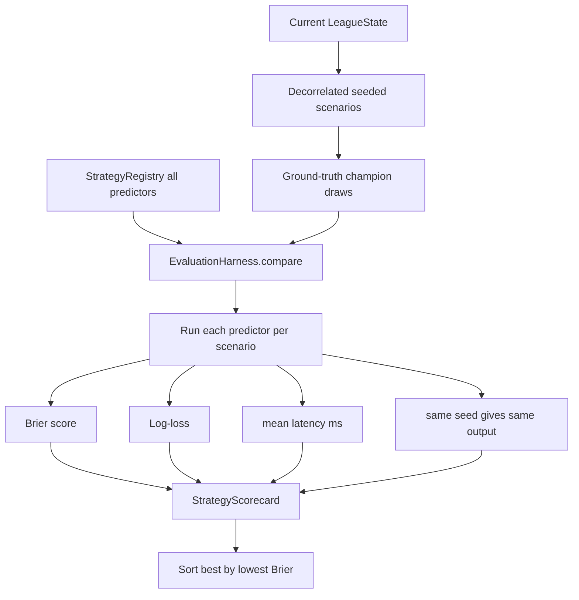
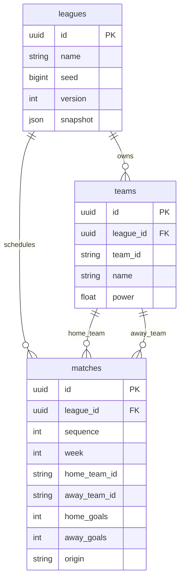

# Architecture Diagrams

This document expands the README architecture summary with the decision-level flows behind the app.

## Mutation and Snapshot Flow

```mermaid
sequenceDiagram
  participant UI as Vue / Pinia
  participant API as Laravel API
  participant App as LeagueService
  participant Domain as Pure domain
  participant Repo as Repository
  participant DB as SQLite

  UI->>API: play-week / play-all / edit result
  API->>App: validated command
  App->>Repo: load LeagueState
  Repo->>DB: read league, teams, ordered matches
  DB-->>Repo: persisted facts
  Repo-->>App: LeagueState
  App->>Domain: schedule / simulate / rank / predict
  Domain-->>App: derived table, fixtures, odds
  App->>Repo: save facts + versioned snapshot
  Repo->>DB: one transaction
  App-->>API: snapshot
  API-->>UI: { version, league, table, fixtures, predictions }
  UI->>UI: discard older version; atomically apply newest snapshot
```

Mutations return one snapshot from one server state. The SPA applies it atomically and ignores older
versions, so table, fixtures, and predictions cannot drift.

## Strategy Seams

`ChampionPredictor` is the one seam that matters: every strategy is a single class behind it, and
the system depends on the interface, never a concrete predictor. It is consumed two ways.



The live read path binds the interface to `SettledOrSimulated` — a *selecting strategy*: a
predicate-guarded chain of responsibility (not a decorator) that asks the exact
`DeterministicClincher` first and falls through to `MonteCarloPredictor` only when no team is
*mathematically* certain. That trigger is a property of the standings, not the calendar, so a title
can short-circuit to an exact `1.0` several weeks early — and at season end, where nothing is left
to sample, the answer is always exact. Because it implements `ChampionPredictor` itself, the chain
is just another strategy and drops into the binding transparently.

The evaluation endpoint instead enumerates the whole field through `StrategyRegistry` — adding a
strategy is a new class plus one line there. `PointsHeuristicPredictor` is a deliberately weak
baseline for that bake-off, not a hidden production fallback.

The simulated predictor is itself assembled from smaller swappable seams — not a monolith:



`ChampionSamplerFactory` compiles a reusable sampler once, composing the `Ranking`, `LeagueTable`,
and the `SeasonSimulator` → `MatchSimulator` → `GoalModel` chain — each an interface (Poisson and
Premier League are today's bindings). Randomness is intentionally absent: a `RandomSource` is passed
in at `predict()` time, never wired as a structural dependency.

## Predictor Decision Flow



The live strategy uses exact math when the league is settled and sampling only when uncertainty
remains. Monte Carlo completes the remaining season repeatedly, ranks each sampled season, and
normalizes champion counts into probabilities.

## Evaluation Harness



The harness scores predictors against realised outcomes from the reference sampler. Common random
numbers make the comparison paired; proper scoring rules reward honest probabilities; latency and
determinism make "better / safer / faster" visible.

## Persistence Model



The stored facts are league identity, roster, seed, fixture order, and optional results. Tables,
fixtures view, predictions, and scorecards are projections; edits overwrite one result and re-fold.
